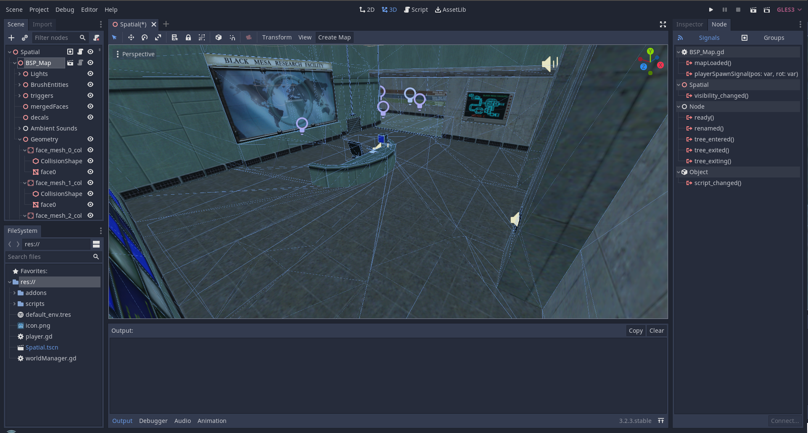

# GodotGoldSrcBSP

##Video Demo
  
  
## Installation
Copy the "addons" folder into the root directory of the Godot Project  
 
Go to Project->Project Settings->Plugins and set the plugins status to "Active"  
  
## Usage  
  
Drag the BSP_Map.tscn file from the addons/gldsrcBSP folder into the scene tree.  
  
Enter thet path to the bsp in "Path" field and Press "Create Map"  
  
If you want the map to generate on runtime don't press "Create Map" and it will automatically be created on launch.  
    
##Entities
  
This plugin supports various but not all entities.  
If you want a body to trigger/interact with the entities add it to the "hlTrigger" group.  

## Media 

